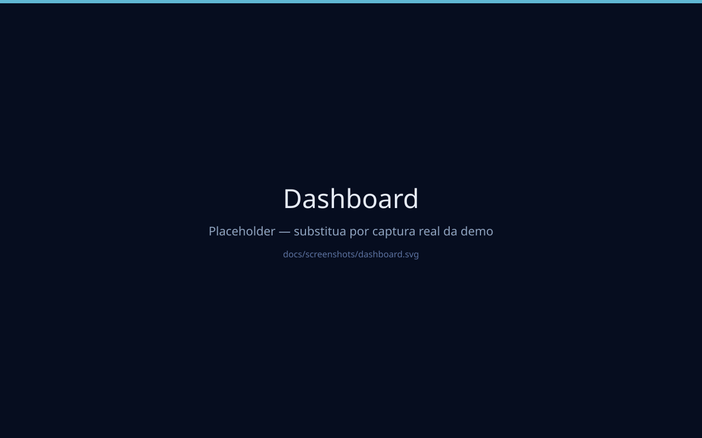
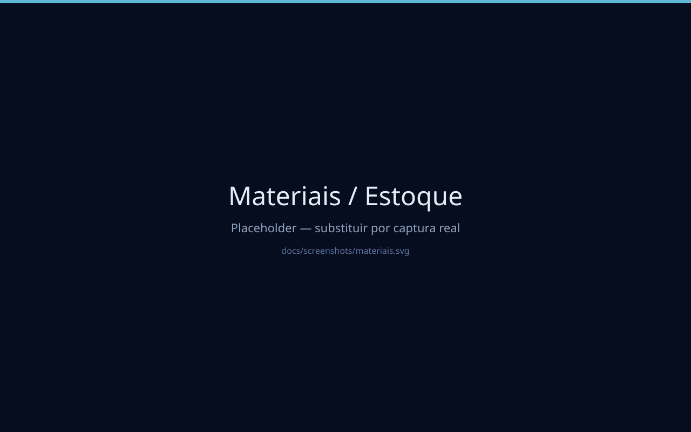
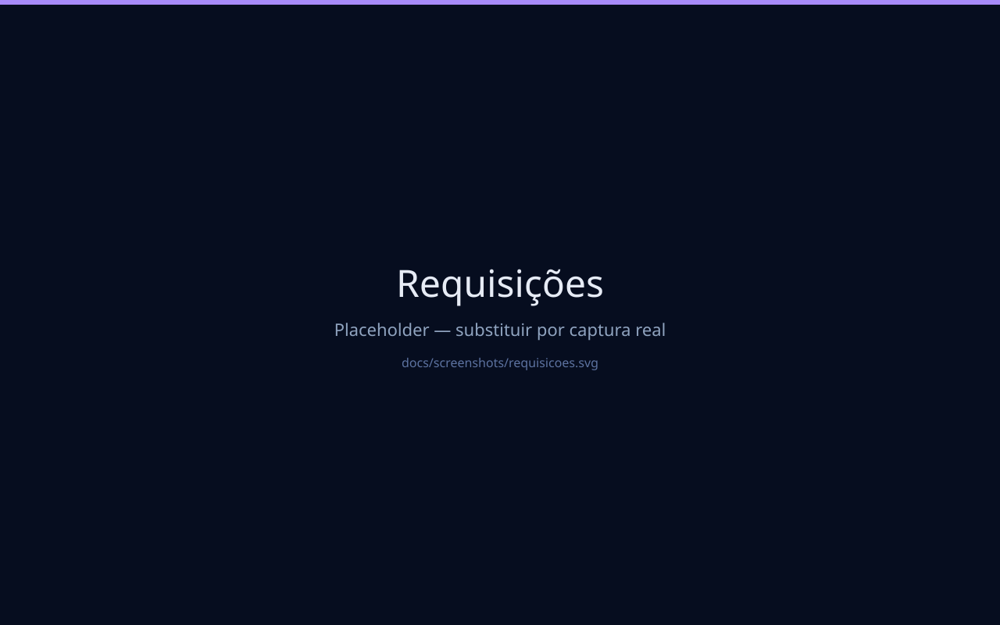
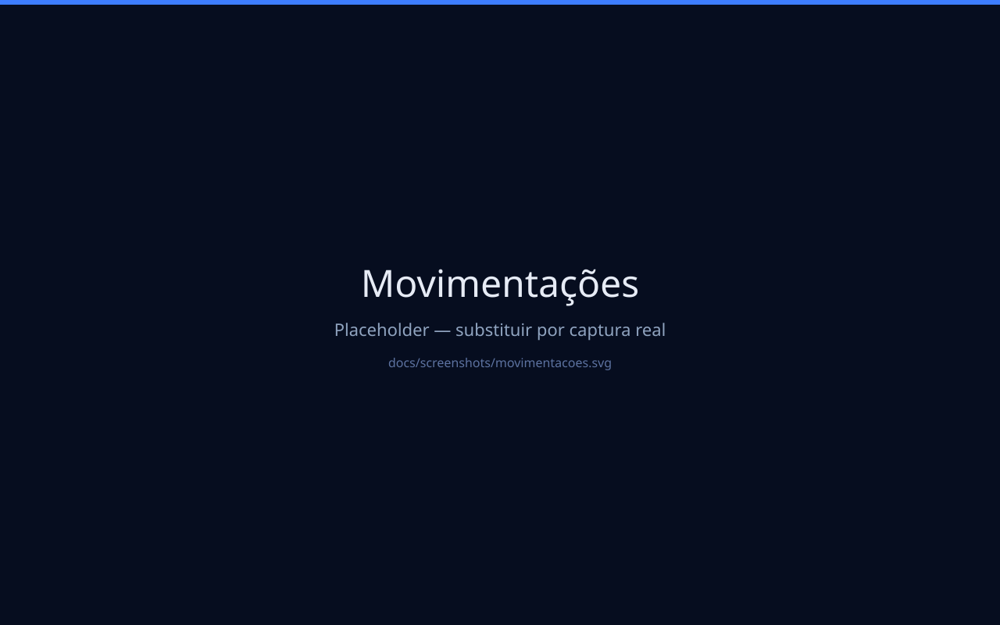
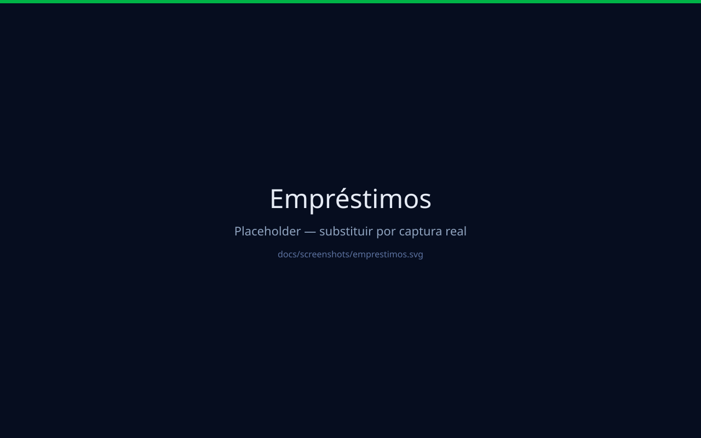
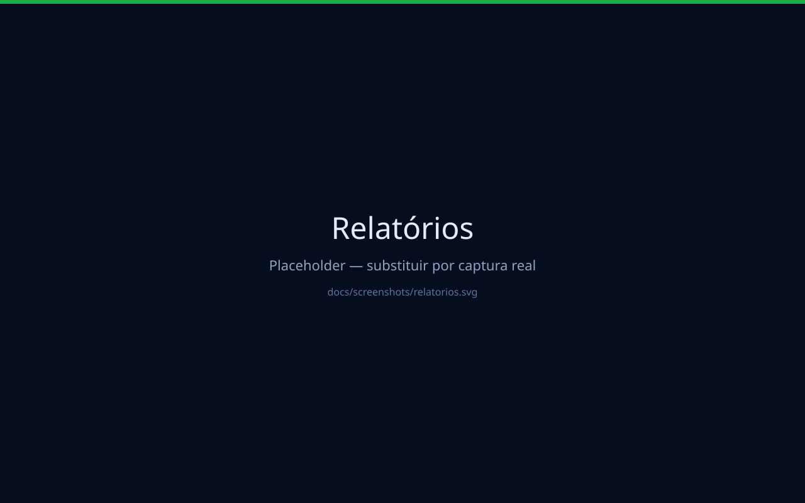
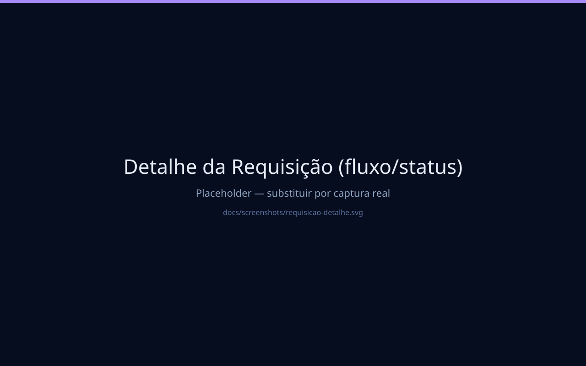
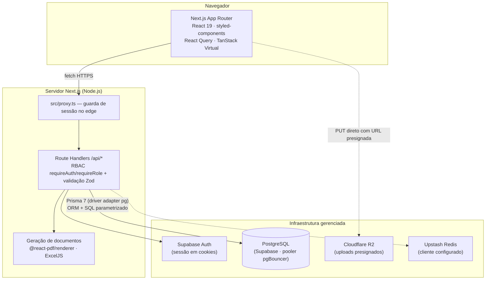
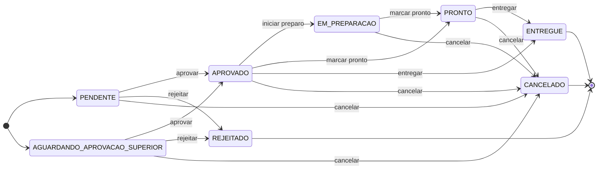

# CBF Almoxarifado


---

## 🚀 Demonstração

Experimente o sistema em **30 segundos**, sem cadastro nem instalação:

[](https://demo-almoxarifado-wheat.vercel.app/)
[](https://github.com/brenotorribt-prog/cbf-almoxarifado)

> 💡 **Login demo** → `demo@almoxarifado.com` / `Demo@1234`
>
> A demo usa um **banco e Supabase exclusivos**, populados com dados
> **100% fictícios** (materiais, pessoas, estoques, requisições, empréstimos,
> compras, notificações). Nenhum dado real da operação está presente
> (veja [`docs/DEPLOY_DEMO.md`](docs/DEPLOY_DEMO.md)).

### Galeria rápida

| | | |
|---|---|---|
|  |  |  |
|  |  |  |
| |  | |

> 📸 As imagens em `docs/screenshots/` são placeholders (SVG) enquanto não
> forem substituídas por capturas reais da demo publicada. Para gerar as versões
> `.png`, siga as instruções em [`docs/screenshots/README.md`](docs/screenshots/README.md).

Sistema web **full stack de gestão de almoxarifado**, desenvolvido sob medida para uma operação real: controle de materiais e estoque, requisições multi-item com fluxo de aprovação hierárquico, empréstimos com rastreio de devolução, pedidos de compra integrados ao recebimento de estoque, relatórios analíticos e exportações em XLSX/CSV/PDF.

---

## Sobre o projeto

O almoxarifado é o ponto de convergência da operação física de uma organização: ferramentas, materiais de consumo, equipamentos, itens de manutenção. Quando esse controle depende de processos manuais, surgem os problemas clássicos — estoque que "some" sem histórico de quem retirou o quê; requisições perdidas entre conversas de WhatsApp e e-mail; empréstimos que nunca voltam; compras sem visão de status; e nenhum dado consolidado para tomada de decisão.

Este sistema foi construído para resolver esse conjunto de problemas de forma definitiva, substituindo o processo manual por uma plataforma única com:

- **Rastreabilidade ponta a ponta** — cada movimentação registra quem solicitou, quem lançou, quantidade anterior e atual, motivo e documento de referência;
- **Fluxo formal de requisições** — pedidos multi-item com aprovação, preparação, entrega e agendamento de retirada;
- **Integridade de estoque garantida em transação** — o saldo nunca diverge do histórico de movimentações;
- **Controle de acesso por papéis (RBAC)** — de solicitante a administrador, com permissões aplicadas no servidor;
- **Inteligência operacional** — dashboard, alertas de estoque mínimo/máximo e relatórios agregados por período, categoria e pessoa.

### Por que este projeto não é um CRUD de estudo

Este sistema nasceu de uma demanda operacional concreta e foi utilizado em produção. As decisões de arquitetura refletem problemas reais: concorrência de escrita no estoque, grandes volumes em listagens, formulários públicos sem autenticação, aprovações hierárquicas, auditoria de alterações e exportação segura de grandes volumes. O histórico de 16 migrações versionadas documenta a evolução incremental do domínio — exatamente como um produto vivo evolui.

---

## Contexto real

O sistema foi desenvolvido e **chegou a ser utilizado em uma operação real de almoxarifado da CBF (Confederação Brasileira de Futebol), na Granja Comary** — atendendo equipes internas em requisições de material, empréstimos de equipamentos, reposição de estoque e prestação de contas.

Quanto à integração com o ERP corporativo (TOTVS): a organização atravessava o processo de implementação da própria plataforma TOTVS, e o escopo dessa integração foi **delimitado pelo contexto contratual daquele momento**. Por essa razão, o sistema foi projetado para **operar de forma autônoma e completa**, com modelo de dados normalizado, histórico auditável e camada de serviços bem definida — características técnicas que mantêm o caminho aberto para integrações futuras, sem que o funcionamento do almoxarifado tenha dependido dessa integração em nenhum momento.

Nenhuma informação confidencial da operação (credenciais, dados de pessoas, estoques reais, infraestrutura interna) está exposta neste repositório.

---

## Principais funcionalidades

### 🔐 Acesso e administração
- Autenticação via **Supabase Auth**, com sessão em cookies gerenciada no servidor;
- Cadastro com **fluxo de aprovação**: nova conta nasce `PENDENTE` até um ADMIN aprovar ou rejeitar;
- Guarda de rotas no edge (`src/proxy.ts` — sucessor do middleware no Next.js 16): rotas públicas, redirecionamentos e proteção das áreas autenticadas;
- **RBAC centralizado no servidor** (`requireAuth`, `requireRole`, `requireAdmin`) com 5 papéis: `ADMIN`, `GESTOR`, `SUPERVISOR`, `ALMOXARIFE` e `SOLICITANTE`;
- Perfil com avatar (upload direto para o storage) e troca de senha com revalidação da senha atual.

### 📊 Dashboard
- KPIs agregados e sensíveis ao papel do usuário: materiais ativos/inativos, estoque baixo/alto, requisições por status, empréstimos ativos/atrasados e compras em aberto;
- Alertas de **estoque crítico** e listagens recentes de requisições e movimentações;
- Contador de acessos pendentes exclusivo para ADMIN.

### 📦 Materiais e estoque
- Catálogo completo: código interno gerado automaticamente, código de barras/QR, marca, fabricante, modelo, número de série, fornecedor, localização física e foto;
- Níveis de estoque **mínimo / ideal / máximo** com sinalização automática (baixo/alto);
- Quantidades com precisão decimal (`DECIMAL(12,3)`) e unidades **inteiras ou fracionadas**;
- Listagem com **paginação keyset (cursor)**, filtros combinados (categoria, situação, faixa de estoque, busca textual) e resumo agregado consultado em paralelo;
- Busca rápida para autocomplete em formulários.

### 🔄 Movimentações de estoque
- Entradas, saídas, ajustes e descartes com **snapshot de quantidade anterior/atual** em cada registro;
- Criação do registro e atualização do saldo sempre dentro de uma **transação atômica**;
- Regras de negócio validadas na API: estoque insuficiente bloqueia a saída (HTTP 409); unidade inteira rejeita fração;
- **Saídas e empréstimos vinculados ao cadastro leve** — quem recebe o material é sempre uma pessoa do cadastro de pessoas atendidas, com nome/setor/função absorvidos automaticamente (sem texto livre);
- Devolução vinculada à movimentação original de saída;
- Comprovante em PDF por movimentação.

### 📋 Requisições (fluxo completo)
- Pedido multi-item em que **cada item tem ciclo de vida próprio**: máquina de estados com aprovação, preparação, marcação de pronto e entrega, além de rejeição/cancelamento e faixa de **aprovação superior** para materiais sensíveis;
- Status do cabeçalho é **agregado e calculado** a partir dos itens, nunca editado diretamente;
- Itens alterados manualmente ficam protegidos contra ações em massa do cabeçalho;
- Três origens de pedido: usuário autenticado, lançamento feito pela equipe em nome de quem pediu (pedido chegado por telefone/WhatsApp) e **formulário público sem login**;
- Agendamento de retirada/entrega com confirmação;
- Histórico de mudanças de status e notificações persistentes para cada evento relevante.

### 🤝 Empréstimos
- Materiais retornáveis geram empréstimo automaticamente na entrega (ou avulso, direto pela tela);
- Aprovação opcional, devolução, descarte e marcação de perda;
- Situação de atraso **derivada na leitura** — sem escritas em rotas de consulta — e alertas de atraso;
- Termo de responsabilidade em PDF com recibo para assinatura.

### 🛒 Compras
- Pedidos com itens de **material existente ou material novo** (com sugestão de especificação completa);
- Ciclo de status por item: espera → orçando → aprovado → aguardando entrega → recebido;
- Recebimento gera **movimentação de entrada no estoque** e recalcula o status agregado do pedido;
- Exportação dos pedidos em XLSX, CSV e PDF.

### 📈 Relatórios e exportações
- Relatório analítico de movimentações com filtros por período, categoria, tipo e pessoa;
- Séries temporais com granularidade hora/dia/semana/mês, ranking de materiais e categorias mais movimentadas e **estoque atualmente em posse de cada pessoa**;
- Gráficos interativos alinhados ao tema visual do sistema;
- Exportação em **XLSX, CSV e PDF**, com proteção contra consultas gigantes: janela máxima de 366 dias e teto de 10 mil linhas por exportação.

### ⚙️ Cadastros auxiliares
- Categorias/áreas, unidades de medida (inteira/fracionada) e **pessoas atendidas** — cadastro leve mantido pela equipe que serve como fonte única de nomes para o formulário público, eliminando duplicidade ("João" vs "joão") nos relatórios.

### 🎨 Identidade visual configurável
- Painel exclusivo do **ADMIN** (*Configurações → Identidade visual*) para definir nome da organização, paleta de cores e imagens sem tocar em código;
- Uploads diretos para o **Cloudflare R2** com URL pré-assinada para logo, background de login/registro e background da sidebar — com preview realista (16:9 no login, vertical na sidebar), avisos de proporção e validação de MIME/tamanho no cliente **e** no servidor;
- Cores semânticas (sucesso/erro/aviso), paleta de especialidades e avatares permanecem protegidas: a configuração altera a marca, nunca o significado dos status.

---

## Destaques de engenharia

Decisões técnicas presentes no código, não no slide:

| Tema | Como foi resolvido |
|---|---|
| **Integridade de estoque** | Toda escrita de saldo acontece em `prisma.$transaction`, junto do registro de movimentação — movimentações, empréstimos, entregas de requisição e recebimentos de compra |
| **Performance em listagens** | Paginação **keyset por cursor** (`numeroSequencial`) com padrão `LIMIT + 1` para detectar próxima página — sem `OFFSET` |
| **Consultas analíticas** | SQL bruto parametrizado (`$queryRaw` / `Prisma.sql`) para agregações com `COUNT ... FILTER`, JOINs e séries temporais por granularidade; queries independentes rodam em `Promise.all` |
| **Grandes volumes no front** | Listas **virtualizadas** (`@tanstack/react-virtual`) + scroll infinito (`useInfiniteQuery`) nas telas de materiais, movimentações e compras |
| **Uploads escaláveis** | Uploads **presignados** para Cloudflare R2 (S3-compatible): URL pré-assinada com TTL de 5 min, arquivo nunca passa pelo servidor da aplicação |
| **Segurança e permissões** | RBAC verificado em cada rota de API; máquina de estados dos itens com transições válidas e papéis permitidos calculados por combinação ação × status no servidor |
| **Validação de entrada** | Schemas **Zod** em todas as rotas, com erros estruturados (`flatten`) e regras de domínio (estoque negativo bloqueado, frações por tipo de unidade, origem do solicitante mutuamente exclusiva) |
| **Auditoria** | Modelos `LogAuditoria` (estado anterior/posterior, IP, user-agent) e `StatusHistory` para trilha de mudanças |
| **Geração de documentos** | PDF server-side com `renderToBuffer` (logos convertidas uma vez por processo, cache em memória) e PDF client-side com lazy loading de bundle |
| **Conexões de banco** | Pool `pg` dimensionado (limite de conexões e timeouts explícitos), singleton à prova de hot-reload, Prisma 7 com **driver adapter** (`@prisma/adapter-pg`) |
| **SSR estável** | styled-components com registry próprio para Server-Side Rendering e tema tipado em toda a aplicação |

---

## Arquitetura

Aplicação **monolita full stack** em Next.js (App Router): o frontend React e a API (Route Handlers) vivem no mesmo deploy, comunicando-se com serviços gerenciados para autenticação, banco e storage.



**Fluxo de uma operação típica** (ex.: entrega de item de requisição):

1. O frontend dispara a ação via `fetch` para a Route Handler correspondente;
2. O proxy valida a sessão; o handler valida papel do usuário (`requireRole`) e os dados de entrada (Zod);
3. A lógica de domínio executa a transição de estado na máquina de status e grava tudo em uma transação Prisma: atualização do item, recálculo do status agregado do pedido, movimentação de estoque com snapshot e notificação;
4. O histórico de status é registrado para auditoria e a UI recebe a resposta tipada.

---

## Stack

| Tecnologia | Utilização |
|---|---|
| **Next.js 16** (App Router) | Framework full stack: páginas, Route Handlers (API) e guarda de sessão no `proxy.ts` |
| **React 19** + **TypeScript 5** | UI componentizada e type-safe de ponta a ponta (strict mode) |
| **styled-components 6** | Design system próprio com tema tipado e SSR via registry dedicado |
| **TanStack React Query 5** | Cache de dados, scroll infinito (`useInfiniteQuery`) e invalidação otimista |
| **TanStack Virtual** | Virtualização de listas para grandes volumes sem degradar a renderização |
| **react-hook-form** + **Zod** | Formulários performáticos com validação compartilhada entre client e API |
| **Prisma 7** | ORM com driver adapter (`@prisma/adapter-pg`), migrações versionadas, transações e SQL bruto parametrizado |
| **PostgreSQL** (Supabase) | Banco relacional com precisão decimal para quantidades, índices por acesso e pooler de conexões |
| **Supabase Auth** (`@supabase/ssr`) | Autenticação por credenciais com sessão em cookies httpOnly |
| **Cloudflare R2** + **AWS SDK S3** | Object storage compatível S3 com upload presignado para fotos de materiais e avatares |
| **@react-pdf/renderer** | Geração de PDFs server-side e client-side (comprovantes, termos de responsabilidade e recibo de assinatura) |
| **ExcelJS** | Exportações XLSX formatadas |
| **recharts** | Gráficos analíticos dos relatórios |
| **framer-motion** | Micro-interações e transições de interface |
| **Upstash Redis** | Cliente Redis configurado na camada `lib` (reservado para cache/rate limiting) |
| **sharp** / **date-fns** / **lucide-react** | Otimização de imagens, utilitários de data (pt-BR) e iconografia |

---

## Estrutura do projeto

```text
src/
├── app/
│   ├── page.tsx                  # landing page pública
│   ├── solicitar/                # formulário público de requisição (sem login)
│   ├── (auth)/                   # login e cadastro com aprovação pendente
│   ├── (app)/                    # área autenticada (layout compartilhado + sidebar)
│   │   ├── dashboard/            # KPIs e alertas por papel
│   │   ├── materiais/            # catálogo e estoque
│   │   ├── movimentacoes/        # movimentações + empréstimos
│   │   ├── requisicoes/          # fluxo de pedidos multi-item
│   │   ├── compras/              # pedidos de compra e recebimento
│   │   ├── relatorios/           # análises e exportações
│   │   ├── categorias/           # categorias, unidades de medida, pessoas atendidas
│   │   └── configuracoes/        # administração de acessos (aprovar/rejeitar usuários)
│   └── api/                      # Route Handlers (API REST interna)
│       ├── admin/usuarios/       # aprovação/rejeição de cadastros
│       ├── materiais/            # CRUD + busca rápida + upload presignado de foto
│       ├── movimentacoes/        # entrada/saída/ajuste/descarte + devolução
│       ├── requisicoes/          # criação, detalhe e ações por item
│       ├── emprestimos/          # aprovar, devolver, descartar, rejeitar
│       ├── compras/              # pedidos, itens, recebimento e exportação
│       ├── relatorios/exportar/  # XLSX | CSV | PDF
│       ├── publico/              # endpoints do formulário sem autenticação
│       └── dashboard/ pdf/ perfil/ pessoas-atendidas/ ...
├── components/                   # UI organizada por domínio (+ modals e documentos PDF)
├── lib/
│   ├── prisma.ts                 # client Prisma + pool pg (singleton)
│   ├── auth/require-role.ts      # guards RBAC das rotas de API
│   ├── storage/                  # Cloudflare R2 (presign, delete)
│   ├── supabase/                 # clients server/browser do Supabase Auth
│   ├── requisicoes/              # lógica de domínio e máquina de estados
│   ├── exportacoes/              # camada de dados + geradores XLSX/CSV/PDF
│   └── pdf/ redis.ts utils/
├── providers/                    # React Query + tema styled-components
├── hooks/ · styles/ · types/
prisma/
├── schema.prisma                 # 15 modelos e enums de domínio
├── migrations/                   # 16 migrações versionadas
└── seed.ts                       # cria o usuário ADMIN inicial

```

---

## Modelo de dados e fluxos

O coração do domínio é a dupla **`Solicitacao`** (cabeçalho do pedido) + **`ItemSolicitacao`** (uma linha por material), desenhada para pedidos multi-item: aprovação, preparo e entrega acontecem **por item**, enquanto o cabeçalho mantém um status agregado recalculado a cada mudança. Entregas geram `MovimentacaoEstoque` — e, quando o material é retornável, também um `Emprestimo`. Complementam o domínio: `Material`, `Categoria`, `UnidadeMedida`, `PessoaAtendida`, `PedidoCompra`/`ItemPedidoCompra`, `Agendamento`, `Notificacao`, `StatusHistory` e `LogAuditoria`.

### Máquina de estados do item de requisição

Cada item segue um ciclo de vida próprio. Os estados e as transições abaixo refletem exatamente a tabela `TRANSICOES` (em `src/lib/requisicoes/requisicoes-helpers.ts`):



> Legend: o marcador `[*]` indica o **início** da máquina (após a criação: `PENDENTE` para materiais comuns; `AGUARDANDO_APROVACAO_SUPERIOR` para materiais marcados com `requerAprovacao = true`) e o **fim** (estados terminais `ENTREGUE`, `REJEITADO` e `CANCELADO`).

#### Autorização por ação (aplicada no servidor)

As permissões não estão nos rótulos do diagrama porque no código são definidas por **combinação de ação × status do item**, via `papeisPermitidosParaAcao(acao, status)`:

| Ação · status de origem | Papéis autorizados |
|---|---|
| `APROVAR` ou `REJEITAR` quando o item está em `AGUARDANDO_APROVACAO_SUPERIOR` | `ADMIN`, `GESTOR`, `SUPERVISOR` |
| Qualquer outra ação (aprovar/rejeitar item pendente, iniciar preparo, marcar pronto, entregar, cancelar) | `ADMIN`, `GESTOR`, `SUPERVISOR`, `ALMOXARIFE` |

O papel `SOLICITANTE` não executa nenhuma ação de gestão — ele apenas cria e acompanha as próprias requisições. A entrada `AGUARDANDO_APROVACAO_SUPERIOR` só existe para materiais sensíveis (`Material.requerAprovacao = true`), exigindo um nível hierárquico maior para aprovação/rejeição — exatamente como `papeisPermitidosParaAcao` implementa.

### Papéis e permissões

| Papel | Escopo |
|---|---|
| **ADMIN** | Acesso total: administração de usuários (aprovar/rejeitar acessos) e configurações |
| **GESTOR / SUPERVISOR** | Gestão de requisições e **aprovação superior** de itens sensíveis; visão completa do dashboard |
| **ALMOXARIFE** | Operação diária: preparo/entrega de pedidos, movimentações de estoque, empréstimos e compras |
| **SOLICITANTE** | Criação e acompanhamento das próprias requisições |

---

## Identidade visual configurável

A aplicação possui uma camada explícita de **design tokens + branding por organização**: componentes consomem apenas `theme.colors.*`, `theme.spacing` etc., sem saber de onde o tema veio. Não existe nenhum `if (cliente === ...)` no código — a identidade vem de configuração persistida.

```text
theme default (estrutural + brand neutro)
        +
configuração persistida (cores/nome/imagens do ADMIN)
        =
Theme resolvido → <ThemeProvider> → toda a aplicação
```

- **Tokens estruturais** (tipografia, spacing, raios, sombras, transições, breakpoints, status semânticos, especialidades, paleta de gráficos base) ficam fixos em `src/styles/theme.ts`;
- **Tokens de marca** (primária, accent, destaque, superfícies, sidebar, textos, links, nome e imagens) podem ser sobrescritos via painel admin;
- A resolução acontece **no servidor, uma vez por request** (`obterIdentidadeVisual()` no root layout, com `React.cache`), antes da primeira pintura — sem flash de tema e sem mismatch de hidratação. Falha de banco ⇒ tema default;
- Persistência em tabela singleton `ConfiguracaoVisual` (migração aditiva, `CREATE TABLE IF NOT EXISTS`, nada destrutivo): coluna nula = usar default;
- Imagens seguem o mesmo fluxo presignado do R2 já usado nas fotos de materiais: nova imagem sobe e só então a referência troca; cleanup do antigo é best-effort e posterior.

**Fallbacks locais** (`public/branding/`, neutros e versionados): `logo-default.png`, `login-background-default.png` (16:9) e `sidebar-background-default.png` (vertical). São usados quando não há configuração ou a URL falha. Recomendações exibidas no próprio painel: login **16:9** (ex.: 1920×1080, cortes via `object-fit: cover`) e sidebar **vertical ~2:3** (ex.: 800×1200).

PDFs (recibos, movimentações, empréstimos, relatórios e compras) resolvem o logo pela mesma cadeia (configuração → fallback) e a segurança é garantida no servidor: `PATCH` exige **ADMIN** (`requireAdmin`), com validação Zod que aceita apenas `#RRGGBB` e URLs http(s) de imagem — nada de CSS/HTML/SVG arbitrário.

## Como executar localmente

### Pré-requisitos

- **Node.js 20+** e npm;
- Um projeto **Supabase** (fornece o PostgreSQL e o Auth);
- Um bucket **Cloudflare R2** (necessário para os recursos de upload de fotos/avatares);
- Opcional: instância **Upstash Redis** (o cliente já está configurado, mas nenhuma rota depende dele hoje).

### 1. Clonar e instalar

```bash
git clone https://github.com/seu-usuario/cbf-almoxarifado.git
cd cbf-almoxarifado
npm install   # o postinstall já roda `prisma generate`
```

### 2. Configurar variáveis de ambiente

Crie um arquivo **`.env.local`** na raiz (ele não é versionado) com as variáveis abaixo — os valores vêm dos painéis do Supabase, Cloudflare R2 e Upstash:

```env
# Banco de dados (Supabase PostgreSQL)
DATABASE_URL="postgresql://<usuario>:<senha>@<host>:6543/postgres"   # conexão poolada usada pela aplicação
DIRECT_URL="postgresql://<usuario>:<senha>@<host>:5432/postgres"     # conexão direta usada pelas migrações

# Autenticação (Supabase → Project Settings → API)
NEXT_PUBLIC_SUPABASE_URL="https://<seu-projeto>.supabase.co"
NEXT_PUBLIC_SUPABASE_ANON_KEY="<anon-key>"

# Storage de arquivos (Cloudflare R2)
R2_ACCOUNT_ID="<account-id>"
R2_ACCESS_KEY_ID="<access-key-id>"
R2_SECRET_ACCESS_KEY="<secret-access-key>"
R2_BUCKET_NAME="<nome-do-bucket>"
R2_PUBLIC_URL="https://<dominio-publico-do-bucket>"

# Seed — usada apenas no script de seed para criar o usuário ADMIN
SUPABASE_SERVICE_ROLE_KEY="<service-role-key>"
```

> A aplicação usa a conexão **poolada** (`DATABASE_URL`) para operar e a **direta** (`DIRECT_URL`) para migrações, conforme definido em `prisma.config.ts`.

### 3. Aplicar o schema no banco

```bash
npx prisma migrate deploy
```

### 4. Criar o usuário ADMIN (seed)

No arquivo `prisma/seed.ts`, preencha `ADMIN_EMAIL` e `ADMIN_SENHA` com as credenciais desejadas e rode:

```bash
npm run seed
```

O seed cria o usuário no Supabase Auth (e-mail confirmado) e o espelha na tabela `User` com papel `ADMIN` e status `APROVADO`.

### 5. Rodar

```bash
npm run dev
```

Acesse **http://localhost:3000**. Faça login com o ADMIN do seed; novos cadastros feitos pela tela de registro ficam pendentes até serem aprovados em **Configurações**.

---

## Scripts disponíveis

| Comando | O que faz |
|---|---|
| `npm run dev` | Servidor de desenvolvimento (Next.js) |
| `npm run build` | `prisma generate` + build de produção |
| `npm run start` | Servidor de produção |
| `npm run lint` | ESLint (config `eslint-config-next`), sem erros nem avisos |
| `npm run typecheck` | Checagem de tipos estrita (`tsc --noEmit`) |
| `npm run test` | Testes unitários das regras críticas (Vitest) |
| `npm run test:watch` | Modo watch do Vitest |
| `npm run seed` | Cria o usuário ADMIN inicial (`dotenv -e .env.local -- tsx prisma/seed.ts`) |
| `npm run seed:demo` | Popula o **ambiente demo** com dados fictícios (exige `DEMO_ENV=true`; não usa `.env.local`) |
| `npx prisma migrate deploy` | Aplica as migrações versionadas no banco |

### Qualidade e CI

O repositório tem **GitHub Actions CI** (`.github/workflows/ci.yml`) que roda, a cada `push`/PR, as quatro portas de qualidade: **lint**, **typecheck**, **testes unitários** e **build de produção**. Os testes cobrem a máquina de estados das requisições (`requisicoes-helpers`), o cálculo de estoque (`calcularEstoqueNovo`), a geração de código interno, a máscara de telefone e a camada de identidade visual (validação de cores/Zod, proporções de imagem, resolução do tema final, fallbacks e autorização das rotas) — regras puras extraídas das rotas para serem testáveis sem banco.

### Variáveis adicionais (opcionais)

| Variável | Uso |
|---|---|
| `UPSTASH_REDIS_REST_URL` / `UPSTASH_REDIS_REST_TOKEN` | Cliente Upstash Redis (`src/lib/redis.ts`) — reservado para cache/rate limiting |
| `NEXT_PUBLIC_APP_URL` | URL base explícita usada na geração de PDFs (fallbacks: `VERCEL_URL` → `localhost:3000`) |

---

## 🧪 Ambiente de demonstração (portfólio)

Existe um seed exclusivo (**`prisma/demo-seed.ts`**) que popula um banco **demo
isolado** com dados **100% fictícios** — nenhum material, pessoa, estoque ou
requisição real da operação.

- **Isolamento**: a demo usa `DATABASE_URL`/`DIRECT_URL` próprios e só roda com
  `DEMO_ENV=true`. O seed é idempotente (limpa e recria) e **não** é executado
  contra a produção.
- **Identidade neutra**: nenhuma `ConfiguracaoVisual` é criada — o tema usa o
  default "Almoxarifado", sem logos da organização real no portfólio.
- **Papéis exploráveis**: ADMIN, GESTOR, SUPERVISOR, ALMOXARIFE e SOLICITANTE.
- **Login demo**: com `NEXT_PUBLIC_DEMO_ENABLED=true`, o cartão
  “Credenciais de demonstração” é exibido na tela de login.

Rodar a demo localmente:

```bash
# PowerShell (bash: use export VAR="...")
$env:DEMO_ENV="true"
$env:DATABASE_URL="postgresql://...banco-DEMO..."
$env:DIRECT_URL="postgresql://...banco-DEMO..."
$env:NEXT_PUBLIC_SUPABASE_URL="https://demo.supabase.co"
$env:SUPABASE_SERVICE_ROLE_KEY="<service-role>"
$env:DEMO_PASSWORD="Demo@1234"

npx prisma migrate deploy
npm run seed:demo
```

Instruções completas (recursos, env, contas e deploy na Vercel) em
**”[`docs/DEPLOY_DEMO.md`](docs/DEPLOY_DEMO.md)”**.

---

## Melhorias planejadas

Evolução mapeada a partir do próprio código:

- **Rate limiting** nos endpoints públicos do formulário sem login usando o cliente Upstash Redis já configurado;
- **Camada de cache** para consultas de leitura de alto tráfego;
- **Integração com ERP**, retomável quando o contexto organizacional/contratual permitir — o modelo de dados normalizado e auditável foi desenhado para viabilizar esse passo.

---

## Notas finais

- Projeto **privado**, desenvolvido para uma operação real e disponibilizado aqui como portfólio técnico. Nenhum dado operacional real (materiais, pessoas, estoques ou credenciais) acompanha este repositório;
- Deploy padrão de aplicações Node/Next.js (`next build` + `next start`), compatível com plataformas como Vercel;
- Marcas mencionadas (CBF, Supabase, Cloudflare, TOTVS) pertencem aos seus respectivos titulares e são citadas apenas em caráter contextual.
